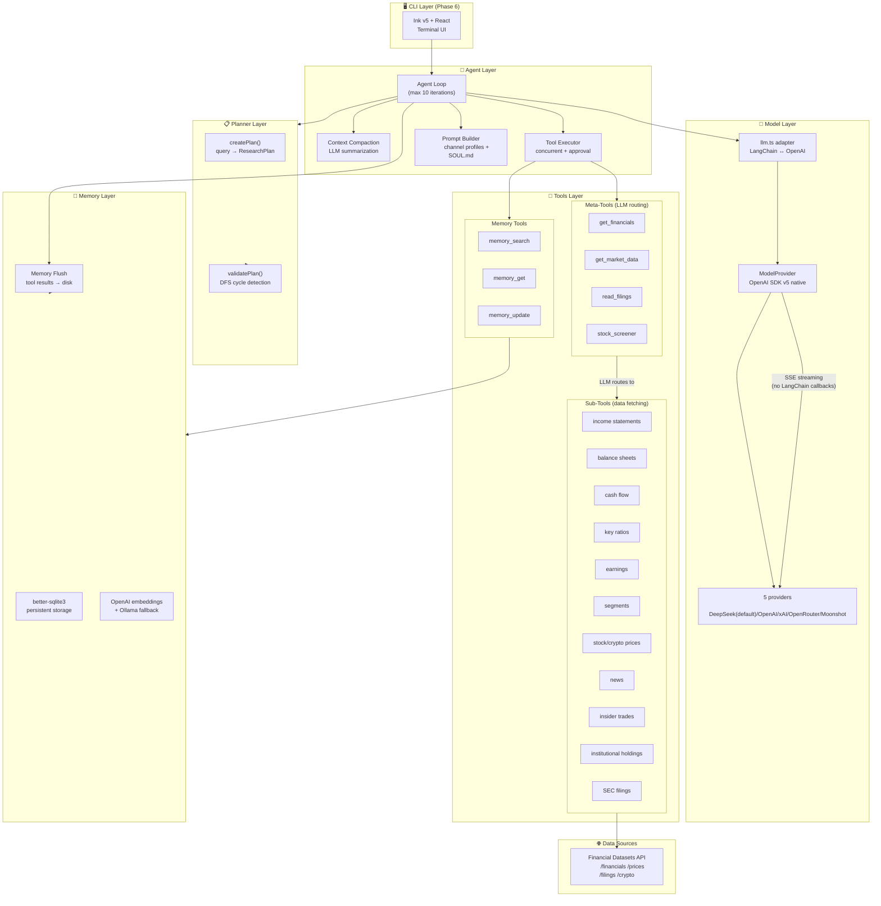
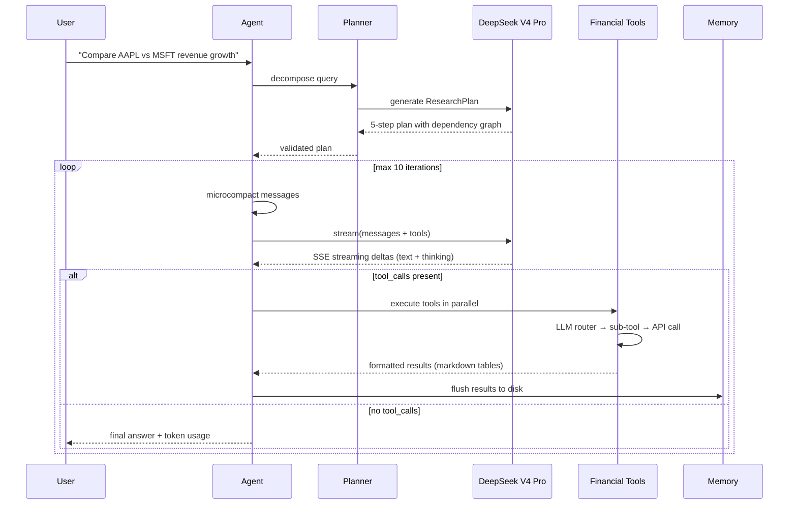
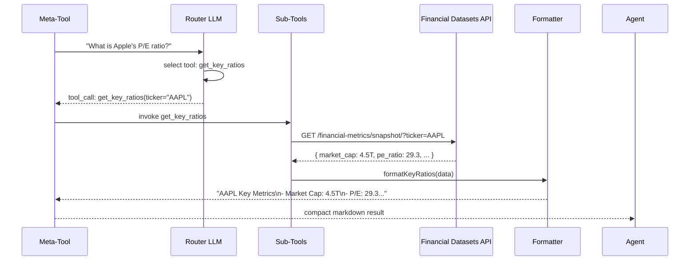

# Dexter Pro 🤖

Dexter Pro is an autonomous financial research agent that thinks, plans, and learns as it works. It performs analysis using task planning, self-reflection, and real-time market data. Think Claude Code, but built specifically for financial research.

> **Forked from [virattt/dexter](https://github.com/virattt/dexter)** (MIT, ~25K stars) — rearchitected with native OpenAI SDK streaming, DeepSeek V4 Pro as the default LLM, and a lighter dependency footprint (24→9 runtime packages).

---

## Architecture



### Layer Descriptions

| Layer | Files | Responsibility |
|---|---|---|
| **Agent** | `src/agent/` (11 files) | Agent loop, context compaction, tool execution, prompt building |
| **Planner** | `src/planner/` (4 files) | LLM-driven query decomposition into dependency-ordered steps |
| **Model** | `src/model/` (5 files) | OpenAI SDK native streaming, provider abstraction, LangChain type adapter |
| **Tools** | `src/tools/` (24 files) | 4 meta-tools + 17 sub-tools + 3 memory tools + formatters |
| **Memory** | `src/memory/` (12 files) | SQLite storage, embeddings, search, temporal decay, MMR reranking |
| **Utils** | `src/utils/` (24 files) | Caching, logging, token counting, markdown tables, error handling |

### Agent Loop Flow



### Data Flow: Meta-Tool Internal Routing



---

## CLI UI Component Tree (Planned — Phase 6)

```
<App>
├── <Header>
│   ├── <Logo />              "Dexter Pro"
│   └── <StatusBar />         provider, model, session time
│
├── <ChatView>
│   ├── <MessageList>
│   │   ├── <UserMessage />   query bubble
│   │   └── <AgentMessage />  response with markdown
│   │       ├── <Markdown />  tables, bold, links
│   │       └── <SourceList /> source URLs
│   │
│   └── <StreamingIndicator>
│       ├── <ModeIcon />      … ▌ ○ ◇ (requesting/responding/thinking/tool-use)
│       └── <TypewriterText /> animated character output
│
├── <ProgressPanel>           (collapsible sidebar)
│   ├── <PlanView>
│   │   └── <StepList />
│   │       ├── <Step />      id, goal, status icon
│   │       └── <DependencyArrow />
│   └── <ToolCallLog>
│       └── <ToolEntry />     name, args, result size, timing
│
├── <InputBar>
│   ├── <Prompt />            "$ "
│   └── <TextInput />         multi-line, history
│
└── <Footer>
    ├── <TokenCounter />      "12.4K in / 3.2K out"
    └── <IterationCounter />  "iteration 3/10"
```

---

## Financial Tools Reference

### Meta-Tool Architecture

Each meta-tool follows the same pattern: natural language query → LLM router selects sub-tools → parallel execution → formatter → compact markdown output.

### Tool Summary

| Meta-Tool | Description | Sub-Tools |
|---|---|---|
| **get_financials** | Financial statements, metrics, ratios, earnings, segments | 8 sub-tools |
| **get_market_data** | Stock/crypto prices, news, insider trades, institutional holdings | 9 sub-tools |
| **read_filings** | SEC filing content (10-K, 10-Q, 8-K) with section-level retrieval | 3 sub-tools |
| **stock_screener** | Screen stocks by valuation, profitability, growth, sector criteria | 1 sub-tool (API) |

### Example Inputs & Outputs

#### 1. get_financials

```
Input:  "What is Apple's current P/E ratio, market cap, revenue growth, and net margin?"
Router: → get_key_ratios(ticker="AAPL")

Output:
AAPL Key Metrics
- Market Cap: 4.5T
- P/E: 29.3 | EPS: $7.15
- Revenue Growth: 5.2% | Earnings Growth: 8.1%
- Gross Margin: 47.8% | Op Margin: 32.4% | Net Margin: 27.0%
- D/E: 0.87
```

```
Input:  "Get Microsoft's annual revenue and net income for the last 3 fiscal years"
Router: → get_income_statements(ticker="MSFT", period="annual", limit=3)

Output:
MSFT Income Statement

| Period | Revenue | Op Inc  | Net Inc  | EPS    |
|--------|---------|---------|----------|--------|
| Q2 25  | 281.7B  | 128.5B  | 101.8B   | $13.70 |
| Q2 24  | 245.1B  | 109.4B  | 88.1B    | $11.86 |
| Q2 23  | 211.9B  | 88.5B   | 72.4B    | $9.72  |
```

#### 2. get_market_data

```
Input:  "What's the current stock price and market cap for NVDA?"
Router: → get_stock_price(ticker="NVDA")

Output:
NVDA: $214.30 (H: — L: —) Vol: —
```

```
Input:  "Show me the latest news headlines for TSLA"
Router: → get_company_news(ticker="TSLA")

Output:
1. Tesla Inc (NASDAQ:TSLA) Shows Strong Growth and Technical Setup — ChartMill, 2026-05-23
2. 1,256 Shares in Tesla, Inc. Acquired by Platt Wealth Management LLC — MarketBeat, 2026-05-23
3. Karras Company Inc. Takes $2.44 Million Position in Tesla, Inc. — MarketBeat, 2026-05-23
```

#### 3. read_filings

```
Input:  "Show me Apple's risk factors from their latest 10-K filing"
Step 1: Plan  → { ticker: "AAPL", filing_types: ["10-K"], limit: 1 }
Step 2: Fetch → get_filings → accession_number
Step 3: Read  → get_10K_filing_items(accession="...", items=["Item-1A"])

Output:
AAPL 10-K — Item 1A (Risk Factors)
[Full SEC filing text with risk factor sections]
```

#### 4. stock_screener

```
Input:  "Find large cap tech stocks with P/E under 30 and revenue growth above 10%"
Step 1: Fetch metrics catalog from API
Step 2: Structured output → {
  filters: [
    { field: "sector", operator: "eq", value: "Information Technology" },
    { field: "pe_ratio", operator: "lt", value: 30 },
    { field: "revenue_growth", operator: "gt", value: 0.10 },
    { field: "market_cap", operator: "gt", value: 50000000000 }
  ],
  currency: "USD",
  limit: 25
}
Step 3: POST /financials/search/screener/

Output:
Matching stocks with metric values for each filter criterion
```

```
Input:  "Find healthcare sector stocks with market cap above 10B and ROE above 15%"
Output: {
  filters: [
    { field: "sector", operator: "eq", value: "Health Care" },
    { field: "market_cap", operator: "gt", value: 10000000000 },
    { field: "return_on_equity", operator: "gt", value: 0.15 }
  ]
}
```

---

## How to Install

1. Clone and install:
```bash
git clone <repo-url>
cd dexter-2026.5.20
bun install
```

2. Set up `.env`:
```bash
cp env.example .env
```

Required environment variables:
```bash
# LLM Provider (DeepSeek by default)
LLM_PROVIDER=deepseek
DEEPSEEK_API_KEY=sk-your-key-here

# Financial data (required for tools)
FINANCIAL_DATASETS_API_KEY=your-key-here
```

3. Verify:
```bash
bun run typecheck          # 0 errors
bun run src/verify-e2e.ts  # Agent loop test
bun run src/verify-planner.ts  # Planner test
bun run src/verify-finance.ts  # Financial tools test
```

## How to Run

```bash
bun start    # Interactive mode (Phase 6)
bun dev      # Watch mode
```

## Development Phases

| # | Phase | Status | Commit |
|---|---|---|---|
| 1 | Project init + ModelFactory | ✅ | `93a4619` |
| 2 | Agent loop E2E verification | ✅ | `7c88175` |
| 3 | Task Planner | ✅ | `526f435` |
| 4 | Financial data tools verified | ✅ | `c353624` |
| 5 | Agent Executor + Self-Validation | 🔜 | — |
| 6 | CLI UI (Ink v5) | 🔜 | — |
| 7 | Local Memory + Report Export | 🔜 | — |
| 8 | Testing, docs, deployment | 🔜 | — |

## Key Architecture Decisions

1. **Native OpenAI SDK streaming** — bypasses LangChain callbacks entirely; SSE iterator drives the typewriter effect directly
2. **DeepSeek V4 Pro as default** — 90%+ cheaper than GPT-5, supports reasoning/thinking mode
3. **Meta-tool pattern** — LLM-based routing: one natural language query → sub-tool selection → parallel execution → formatted output
4. **Zod v3/v4 compatibility layer** — `@langchain/core` uses Zod v3 types; project uses Zod v4. Runtime duck-typing bridges the gap
5. **Dependency diet** — 24 packages → 9. Removed: all @langchain/* providers, playwright, baileys, gray-matter, exa-js
6. **DFS cycle detection** — planner validates dependency graphs before execution
7. **Data formatters** — raw API JSON → compact markdown tables, 5-10x token reduction

## License

MIT — based on [virattt/dexter](https://github.com/virattt/dexter)
