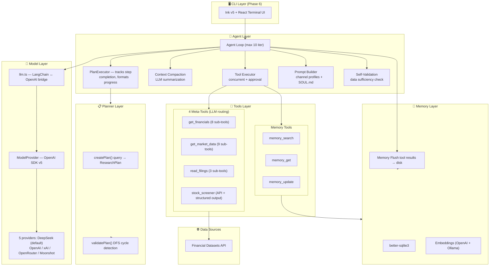
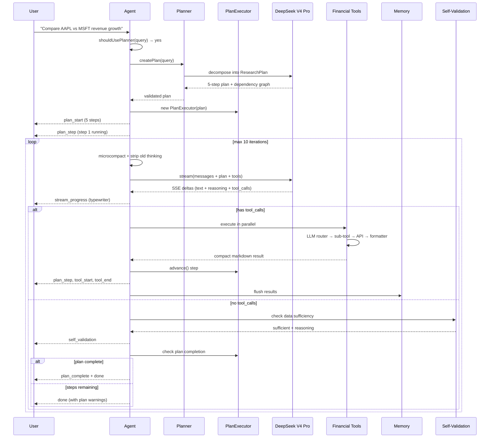

quant agent

**AI 驱动的金融研究智能体 —— 集数据查询、ML 量化分析、策略回测和 Web 仪表盘于一体。**

## 🚀 核心亮点

- **自主金融研究 Agent**：基于 LangChain 的智能体，支持复杂查询规划、自我验证和工具调用。
- **ML 量化分析管线**：纯 TypeScript 实现 15+ 技术指标，结合 XGBoost 模型进行股票涨跌预测，并提供回测引擎（止损/止盈/仓位管理/权益曲线）。
- **多数据源支持**：默认使用东方财富 HTTP API（免费、无需 Key），覆盖 A 股/港股/美股；保留 Financial Datasets 和 Yahoo Finance 备用。
- **全功能 Web 界面**：零依赖的 Web 服务器（Bun.serve），提供 SSE 流式分析、Agent 对话、策略配置和历史记录管理。
- **策略可配置**：通过 `.dexter/strategy.json` 自定义交易参数（仓位、阈值、因子权重等），无需改代码。
- **多模型切换**：默认 DeepSeek V4 Pro，同时支持 OpenAI、Anthropic、Google Gemini、xAI Grok、Ollama 本地模型等。
- **记忆系统**：基于 SQLite 的持久记忆和对话历史，支持向量搜索。
- **CLI 与 Web 双模式**：保留原有的 Ink/React 终端 UI，同时新增现代化 Web 仪表盘。

## 🛠 技术栈

| 层级 | 技术 |
|------|------|
| 运行时 | Bun + TypeScript |
| Agent 框架 | LangChain |
| LLM | DeepSeek V4 Pro / OpenAI / 多 provider |
| 量化分析 | XGBoost (Python 子进程) + 15 项纯 TS 技术指标 |
| 数据源 | 东方财富 HTTP API（国内直连）、Financial Datasets API |
| Web 服务器 | Bun.serve + SSE + WebSocket |
| 存储 | SQLite (better-sqlite3) + JSON 配置文件 |
| CLI UI | Ink v5 + React 18 |

## 📦 快速开始

\`\`\`bash
# 安装依赖
bun install

# 启动 CLI 模式
bun run start

# 启动 Web 服务器 (默认端口 3100)
bun run web
\`\`\`

Web 界面打开后，你可以直接在搜索框输入股票代码（如 `AAPL`、`09868`），点击“分析”即可触发完整的 ML 分析流程；也可以在聊天页与 Agent 进行多轮对话。

## 🙏 致谢

本项目灵感来源于 [virattt/dexter](https://github.com/virattt/dexter)（MIT License），在其基础架构上进行了重大扩展：用 TypeScript + Bun 重写核心、新增 ML 预测与回测引擎、集成东方财富数据源、增加 Web 仪表盘和策略配置系统。同样以 MIT 协议开源。
# QuantAgent 📈

An AI-powered financial research agent with stock prediction, ML quantitative pipeline, and web dashboard.

## Highlights

- Autonomous agent for multi-step financial research with self-validation.
- Full ML pipeline: 15+ technical indicators (pure TS), XGBoost prediction, rolling backtest with position sizing.
- Multi-market data (US/HK/China A-shares) via free East Money API.
- Web UI with SSE streaming, agent chat, strategy editor, and history.
- Strategy configurable via JSON (stop-loss, take-profit, factor weights).
- Supports DeepSeek, OpenAI, Anthropic, Gemini, Grok, Ollama, etc.

> **Forked from [virattt/dexter](https://github.com/virattt/dexter)** (MIT, ~25K stars) — rearchitected with native OpenAI SDK streaming, DeepSeek V4 Pro as the default LLM, East Money (东方财富) for China-accessible data, and a full ML quant pipeline.

---

## Architecture



### Layer Descriptions

| Layer | Files | Responsibility |
|---|---|---|
| **Agent** | `src/agent/` (12 files) | Agent loop, PlanExecutor, context compaction, tool execution, self-validation, prompt building |
| **Planner** | `src/planner/` (4 files) | LLM-driven query decomposition into dependency-ordered steps with cycle detection |
| **Model** | `src/model/` (5 files) | OpenAI SDK native SSE streaming, 5-provider abstraction, LangChain type adapter |
| **Tools** | `src/tools/` (24 files) | 4 LLM-routed meta-tools, 17 sub-tools, 3 memory tools, compact formatters |
| **Memory** | `src/memory/` (12 files) | SQLite storage, embeddings, vector search, temporal decay, MMR reranking |
| **Utils** | `src/utils/` (24 files) | Caching, logging, token counting, markdown tables, progress channels, error handling |

### Full Agent Lifecycle



---

## Event System

QuantAgent emits richly-typed events throughout the agent lifecycle, enabling real-time UI rendering.

### Event Catalog (20 types)

| # | Event | Layer | Role in Self-Validation Loop |
|---|---|---|---|
| 1 | `plan_start` | Planner | Kicks off the validation cycle — defines what "complete" means |
| 2 | `plan_step` | PlanExecutor | Tracks per-step progress; UI re-renders on each step advance |
| 3 | `plan_complete` | PlanExecutor | Signals all planned steps finished — gates the final answer |
| 4 | `self_validation` | Agent | **Core validation gate** — checks data sufficiency before `done` |
| 5 | `done` | Agent | Terminal event — carries answer, token usage, timing |
| 6 | `stream_progress` | Model | Typewriter effect; mode transitions (requesting→thinking→responding→tool-use) |
| 7 | `thinking` | Agent | LLM reasoning text emitted before tool calls |
| 8 | `tool_start` | ToolExecutor | Tool invocation begins; UI shows spinner |
| 9 | `tool_progress` | ToolExecutor | Mid-execution status updates from long-running sub-tools |
| 10 | `tool_end` | ToolExecutor | Tool completed; result size and timing reported |
| 11 | `tool_error` | ToolExecutor | Tool failed; error surfaced to agent for re-planning |
| 12 | `tool_approval` | ToolExecutor | Sensitive tool requests user approval (write_file, edit_file) |
| 13 | `tool_denied` | ToolExecutor | User denied tool execution; agent turn ends |
| 14 | `tool_limit` | ToolExecutor | Tool approaching usage limit; guides LLM to try different approach |
| 15 | `compaction` | Agent | Context summarization lifecycle (start → success/failure → end) |
| 16 | `microcompact` | Agent | Per-turn lightweight ToolMessage trimming |
| 17 | `context_cleared` | Agent | Fallback truncation when compaction fails |
| 18 | `memory_flush` | Memory | Tool results persisted to disk before compaction |
| 19 | `memory_recalled` | Memory | Session-start memory loaded into system prompt |
| 20 | `queue_drain` | Agent | Mid-run user messages injected into the conversation |

### Self-Validation Flow

```
Query Received
  │
  ├─ shouldUsePlanner(query)?
  │   ├─ yes → createPlan() → plan_start → plan_step
  │   └─ no  → (skip planner)
  │
  ▼
Agent Loop (max 10 iterations)
  │
  ├─ stream LLM (stream_progress + thinking)
  ├─ tool_calls?
  │   ├─ yes → execute tools (tool_start → tool_end/tool_error)
  │   │        → plan_step advance
  │   │        → manage context (microcompact / compaction / memory_flush)
  │   │        → loop
  │   └─ no  → self_validation ─────────────────┐
  │                                               │
  ▼                                               ▼
done ← plan_complete (or warnings if incomplete)  Validation Gate
                                                    │
                                          sufficient? ├─ yes → done
                                                      └─ no  → inject follow-up → loop
```

---

## Phase 6 CLI UI Mockup

```
┌──────────────────────────────────────────────────────────────────────────────┐
│  QuantAgent — autonomous quantitative research agent          deepseek-v4-pro  │
│  ═══════════════════════════════════════════════════════════════════════════ │
├──────────────────────────────────────────────────────────────────────────────┤
│                                                                              │
│  $ Compare AAPL and MSFT revenue growth over the last 3 fiscal years         │
│                                                                              │
│  ┌─ Plan ──────────────────────────────────────────────────────────────┐    │
│  │  ○ fetch_aapl    : Get AAPL annual revenue and net income            │    │
│  │  ○ fetch_msft    : Get MSFT annual revenue and net income            │    │
│  │  ○ calc_growth   : Calculate YoY revenue growth rates (depends: 1,2) │    │
│  │  ▶ synthesize    : Compare growth rates and write conclusion         │    │
│  └──────────────────────────────────────────────────────────────────────┘    │
│                                                                              │
│  ○ Requesting... (DeepSeek V4 Pro)                                           │
│                                                                              │
│  ┌─ Tools ────────────────────────────────────────────────────────────┐    │
│  │  ◆ get_financials("AAPL annual revenue and net income...")          │    │
│  │     → 3 rows returned (821ms)                                       │    │
│  │  ◆ get_financials("MSFT annual revenue and net income...")          │    │
│  │     → 3 rows returned (748ms)                                       │    │
│  │  …                                                                  │    │
│  └──────────────────────────────────────────────────────────────────────┘    │
│                                                                              │
│  ▐                                                                           │
│  │  AAPL Income Statement                                                    │
│  │  | Period | Revenue  | Op Inc  | Net Inc | EPS    |                       │
│  │  |--------|----------|---------|---------|--------|                       │
│  │  | FY 25  | 394.3B   | 128.6B  | 100.4B  | $7.15  |                       │
│  │  | FY 24  | 383.3B   | 119.4B  | 93.7B   | $6.57  |                       │
│  │  | FY 23  | 383.9B   | 114.3B  | 97.0B   | $6.16  |                       │
│  │                                                                           │
│  │  MSFT Income Statement                                                    │
│  │  | Period | Revenue  | Op Inc  | Net Inc | EPS    |                       │
│  │  |--------|----------|---------|---------|--------|                       │
│  │  | FY 25  | 281.7B   | 128.5B  | 101.8B  | $13.70 |                       │
│  │  | FY 24  | 245.1B   | 109.4B  | 88.1B   | $11.86 |                       │
│  │  | FY 23  | 211.9B   | 88.5B   | 72.4B   | $9.72  |                       │
│  │  ▐                                                                        │
│                                                                              │
│  Comparison: AAPL revenue grew 2.7% CAGR vs MSFT 15.3%. MSFT's higher       │
│  margins (45.6% op vs AAPL 32.6%) reflect software vs hardware mix.          │
│                                                                              │
├──────────────────────────────────────────────────────────────────────────────┤
│  12.4K in / 3.2K out  |  iter 3/10  |  45.2s  |  plan: 3/4 steps           │
└──────────────────────────────────────────────────────────────────────────────┘
```

### Layout Zones

```
┌─────────────────────────────────────┐
│  HEADER     logo + status bar       │  Fixed top — always visible
├─────────────────────────────────────┤
│                                     │
│  PLAN       collapsible panel       │  Shown when planner is active
│             step list + deps        │  Auto-collapses when complete
│                                     │
│  TOOLS      collapsible panel       │  Tool calls with timing + result size
│             live execution log      │  Scrolls independently
│                                     │
│  OUTPUT     main chat area          │  Typewriter streaming output
│             markdown rendering      │  Tables rendered as box-draw chars
│             source URLs             │  Scrollable, selectable
│                                     │
├─────────────────────────────────────┤
│  FOOTER     tokens | iter | time    │  Fixed bottom — always visible
└─────────────────────────────────────┘
```

---

## Financial Tools Reference

### Meta-Tool Architecture

Each meta-tool follows the same pattern: natural language query → LLM router selects sub-tools → parallel execution → formatter → compact markdown output.

### Tool Comparison

| Meta-Tool | Sub-Tools | Data Sources | Caching | Structured Output |
|---|---|---|---|---|
| **get_financials** | 8 (income, balance, cash flow, ratios, earnings, segments, historical ratios, all-in-one) | `/financials/` endpoints | 1h–24h TTL | Markdown tables |
| **get_market_data** | 9 (stock price/history/tickers, crypto price/history/tickers, news, insider trades, institutional holdings) | `/prices/` `/crypto/` `/news/` etc. | Conditional (closed windows cached) | Markdown tables + text |
| **read_filings** | 3 (10-K, 10-Q, 8-K item retrieval) | `/filings/` endpoints | 24h TTL (immutable) | Raw filing text |
| **stock_screener** | API-driven (single POST) | `/financials/search/screener/` | Metrics catalog cached | Structured filters |

### Example Inputs & Outputs

#### get_financials

```
Input:  "What is Apple's current P/E ratio, market cap, and net margin?"
Router: → get_key_ratios(ticker="AAPL")

Output:
AAPL Key Metrics
- Market Cap: 4.5T
- P/E: 29.3 | EPS: $7.15
- Revenue Growth: 5.2% | Earnings Growth: 8.1%
- Gross Margin: 47.8% | Op Margin: 32.4% | Net Margin: 27.0%
```

```
Input:  "Get MSFT revenue and net income for 3 fiscal years"
Router: → get_income_statements(ticker="MSFT", period="annual", limit=3)

Output:
MSFT Income Statement
| Period | Revenue | Op Inc  | Net Inc  | EPS    |
|--------|---------|---------|----------|--------|
| Q2 25  | 281.7B  | 128.5B  | 101.8B   | $13.70 |
| Q2 24  | 245.1B  | 109.4B  | 88.1B    | $11.86 |
| Q2 23  | 211.9B  | 88.5B   | 72.4B    | $9.72  |
```

#### get_market_data

```
Input:  "NVDA stock price"
Router: → get_stock_price(ticker="NVDA")
Output: NVDA: $214.30

Input:  "Latest TSLA news"
Router: → get_company_news(ticker="TSLA")
Output: 3 news headlines with source + date
```

#### stock_screener

```
Input:  "Large cap tech with P/E < 30 and revenue growth > 10%"
Structured output: {
  filters: [
    { field: "sector", operator: "eq", value: "Information Technology" },
    { field: "pe_ratio", operator: "lt", value: 30 },
    { field: "revenue_growth", operator: "gt", value: 0.10 },
  ]
}
→ POST /financials/search/screener/
```

#### read_filings

```
Input:  "Apple's risk factors from latest 10-K"
Step 1: Plan → { ticker: "AAPL", filing_types: ["10-K"], limit: 1 }
Step 2: Fetch → get_filings → accession_number
Step 3: Read  → get_10K_filing_items(items=["Item-1A"])
Output: Full SEC Item 1A text
```

---

## How to Install

1. Clone and install:
```bash
git clone <repo-url>
cd dexter-2026.5.20
bun install
```

2. Configure `.env`:
```bash
cp env.example .env
```
```bash
LLM_PROVIDER=deepseek
DEEPSEEK_API_KEY=sk-your-key-here
FINANCIAL_DATASETS_API_KEY=your-key-here  # free at financialdatasets.ai
```

3. Verify all layers:
```bash
bun run typecheck                 # 0 TypeScript errors
bun run src/verify-e2e.ts         # Agent loop (streaming + tool calls)
bun run src/verify-planner.ts     # Planner (3 decomposition tests)
bun run src/verify-finance.ts     # Financial tools (7 API tests)
bun run src/verify-phase5.ts      # Agent + plan + self-validation
```

## How to Run

```bash
bun start    # Interactive mode (Phase 6)
bun dev      # Watch mode for development
```

## Development Phases

| # | Phase | Status | Commit |
|---|---|---|---|
| 1 | Project init + ModelFactory | ✅ | `93a4619` |
| 2 | Agent loop E2E verification | ✅ | `7c88175` |
| 3 | Task Planner | ✅ | `526f435` |
| 4 | Financial data tools verified | ✅ | `c353624` |
| 5 | Agent Executor + Self-Validation | ✅ | `1fd0b1e` |
| 6 | CLI UI (Ink v5) | 🔜 | — |
| 7 | Local Memory + Report Export | 🔜 | — |
| 8 | Testing, docs, deployment | 🔜 | — |

## Key Architecture Decisions

1. **Native OpenAI SDK streaming** — bypasses entire LangChain callback chain; SSE iterator drives typewriter effect
2. **DeepSeek V4 Pro default** — 90%+ cheaper than GPT-5, supports reasoning/thinking mode
3. **Meta-tool pattern** — LLM routes natural language queries to sub-tools; parallel execution with formatters
4. **Zod v3/v4 compatibility** — `@langchain/core` (Zod v3) coexists with project (Zod v4) via runtime duck-typing
5. **Dependency diet** — 24→9 runtime packages. Only `@langchain/core` kept for message/tool types
6. **DFS cycle detection** — planner validates dependency graphs before agent execution
7. **Advisory planning** — plans guide agent behavior but don't force tool calls; LLM may answer from knowledge
8. **Rich event system** — 20 typed events enable real-time UI rendering with fine-grained progress visibility

## 为什么选择 XGBoost

`stock_analyzer` 工具使用 XGBoost（Gradient Boosted Trees）而非 LSTM/Transformer 等深度学习模型：

- **表格数据最优**: XGBoost 在结构化特征（技术指标、量价因子）上的表现长期领先深度学习。Kaggle 竞赛中表格数据的冠军方案绝大多数使用 GBM 系列模型。

- **可解释性**: 特征重要性（gain-based）直接反映每个因子对预测的贡献，用户可以一目了然。LSTM/Transformer 是黑盒模型，无法产出透明的特征排序。

- **鲁棒性强**: XGBoost 内置 L1/L2 正则化、列采样、学习率衰减，天然防止过拟合。对于金融数据（高噪声、低信噪比），这一特性至关重要。

- **滚动验证适配**: walk-forward validation 无 look-ahead bias，每个窗口独立训练一个 XGBoost 模型，严格模拟真实交易中"看到今天数据、预测明天方向"的时序约束。

- **轻量部署**: 通过 Python 子进程调用 XGBoost 训练，Bun 端零依赖。对 2 年日线数据训练耗时约 3-8 秒。

## License

MIT — based on [virattt/dexter](https://github.com/virattt/dexter)
